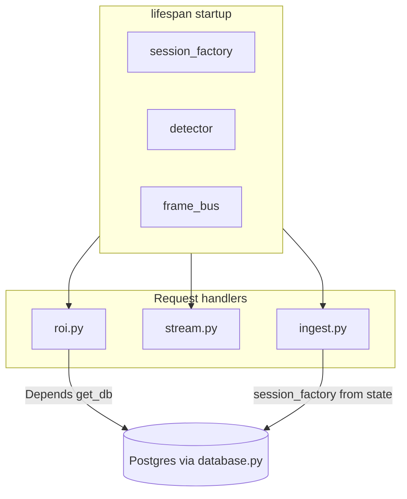

# Overview — backend package layout and boot sequence

## What this backend does

- Accepts **binary JPEG** frames on **WebSocket** `/ws/ingest` (HTTP upgrade).
- Runs **face detection** (MediaPipe Tasks BlazeFace) and returns **ROI JSON** per frame.
- Persists each frame’s result in **PostgreSQL** (`sessions` + `roi_records`).
- Publishes the same raw JPEG bytes to an in-process **frame bus** for passive viewers on **WebSocket** `/ws/stream`.
- Exposes **REST** `GET /api/roi` to query stored rows by session with pagination.

Wire contracts (JSON shapes, query params): see [../docs/API.md](../docs/API.md).

## Folder tree (what to open when)

```
backend/
├── app/
│   ├── main.py           # FastAPI app, lifespan, CORS, router includes
│   ├── config.py         # pydantic-settings → DATABASE_URL, limits, CORS
│   ├── database.py       # async engine, AsyncSessionLocal, get_db, Base
│   ├── models/           # SQLAlchemy ORM: VideoSession, ROIRecord
│   ├── schemas/          # Pydantic response models for REST
│   ├── services/         # FaceDetector, FrameBus
│   └── routers/          # ingest, stream, roi WebSocket/HTTP handlers
├── alembic/              # env.py + versions/* migrations
├── tests/                # pytest (unit + integration + optional E2E)
├── models/               # blaze_face_short_range.tflite (not ORM)
├── scripts/              # download_face_detector_model.py
├── requirements.txt
├── Dockerfile
└── docs/                 # this documentation set
```

## Application entrypoint

The ASGI app object is **`app`** in [`app/main.py`](../app/main.py). Uvicorn loads it as `app.main:app`.

Three routers are mounted:

| Router | Prefix | Endpoints |
|--------|--------|-----------|
| `ingest` | *(none)* | `WS /ws/ingest` |
| `stream` | *(none)* | `WS /ws/stream` |
| `roi` | `/api` | `GET /api/roi` |

## Lifespan and `app.state`

FastAPI’s **`lifespan`** context manager runs once when the server starts and once on shutdown.

On **startup** ([`main.py`](../app/main.py)):

1. `app.state.session_factory = AsyncSessionLocal` — bound to **production** `DATABASE_URL` from settings.
2. `app.state.detector = FaceDetector(...)` — loads the TFLite model from `backend/models/`.
3. `app.state.frame_bus = FrameBus()` — single in-process pub/sub for stream viewers.

On **shutdown**: `detector.close()` is called to release MediaPipe resources.

**Why `app.state`?** WebSocket handlers do not use FastAPI `Depends()` the same way as HTTP routes for the ingest path; they read shared singletons from `websocket.app.state` (detector, bus, session factory).



## Two database access patterns (preview)

- **REST `/api/roi`**: uses `Depends(get_db)` → yields a session from the **global** `AsyncSessionLocal` in [`database.py`](../app/database.py).
- **`/ws/ingest`**: opens `async with session_factory() as db` using **`app.state.session_factory`** (same factory in production; tests replace it — see [04_DATABASE.md](04_DATABASE.md) and [05_TESTING.md](05_TESTING.md)).

Full detail: [04_DATABASE.md](04_DATABASE.md).

## Where diagrams live

High-level component and sequence diagrams for Sprint 1: [../docs/SPRINT_1/BACKEND_CORE.md](../docs/SPRINT_1/BACKEND_CORE.md).

This doc set stays **inside `backend/`** and complements that file with reading order and file pointers.
