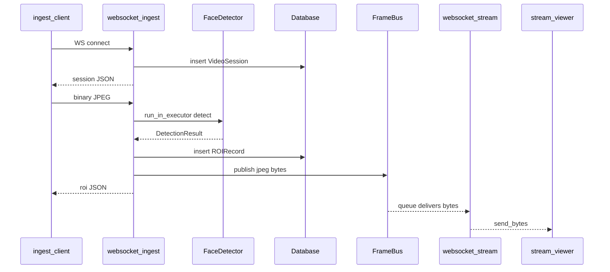

# Execution flows — ingest, stream, REST ROI

This page ties **runtime behavior** to the three router modules. For JSON schemas see [../docs/API.md](../docs/API.md).

---

## Flow A — WebSocket `/ws/ingest`

**Source:** [`app/routers/ingest.py`](../app/routers/ingest.py) — function `websocket_ingest`.

### Phase 1: Accept and create session

1. `await websocket.accept()` — HTTP connection upgrades to WebSocket.
2. Read `session_factory`, `detector`, `frame_bus` from `websocket.app.state` (set in [`main.py`](../app/main.py) lifespan).
3. Open DB: `async with session_factory() as db`.
4. Insert `VideoSession()`, `commit`, `refresh` → obtain `session_id` (UUID).
5. Send JSON handshake: `{"type":"session","session_id":"<uuid>"}`.

### Phase 2: Frame loop

Repeat until disconnect or error on socket:

1. `message = await websocket.receive()`.
2. If `message["type"] == "websocket.disconnect"` → exit loop.
3. If `message.get("bytes")` is missing → `continue` (ignore non-binary frames).
4. If `len(data) > settings.max_frame_bytes` → send `{"type":"error","code":"FRAME_TOO_LARGE",...}` and `continue` (does **not** increment `frame_index`).
5. Run detection off the event loop: `await loop.run_in_executor(None, partial(detector.detect, data))`.
   - On `ValueError` with `INVALID_JPEG` / `INVALID_*` → send `INVALID_FRAME` error JSON.
   - On other `ValueError` or generic `Exception` → send `DETECTION_ERROR` JSON.
   - On any error path → `continue` without incrementing `frame_index` (see tests in [`tests/test_ws_ingest.py`](../tests/test_ws_ingest.py)).
6. Open a **new** DB context: insert `ROIRecord` for this `session_id`, `frame_index`, box + confidence, `commit`.
7. `await frame_bus.publish(data)` — fan-out raw JPEG to all `/ws/stream` subscribers.
8. Send ROI JSON: `{"type":"roi","frame_index":N,...}`.
9. `frame_index += 1`.

### Phase 3: Cleanup

- `WebSocketDisconnect` → log and fall through.
- `finally`: best-effort `websocket.close()` (swallows errors).

**Ordering note:** ROI is written to the DB **before** `publish` and **before** the ROI JSON is sent to the ingest client, so stream viewers see frames only after ingest has committed the row for that frame (same `data` bytes).

---

## Flow B — WebSocket `/ws/stream`

**Source:** [`app/routers/stream.py`](../app/routers/stream.py) — function `websocket_stream`.

1. `await websocket.accept()`.
2. `queue = frame_bus.subscribe()` — bounded `asyncio.Queue` (see [`services/frame_bus.py`](../app/services/frame_bus.py)).
3. Loop: `frame = await queue.get()`.
   - If `frame is None` → break (reserved for future shutdown signal; not used today).
   - Else `await websocket.send_bytes(frame)`.
4. On `WebSocketDisconnect` or exit → `finally: frame_bus.unsubscribe(queue)`.

**Relationship to ingest:** Only **ingest** calls `publish`. Stream is read-only on the bus.

---

## Flow C — REST `GET /api/roi`

**Source:** [`app/routers/roi.py`](../app/routers/roi.py) — function `list_roi`.

1. FastAPI injects `AsyncSession` via `Depends(get_db)` from [`database.py`](../app/database.py).
2. Parse `session_id` (UUID), `limit` (1–1000), `offset` (≥ 0) from query string.
3. `session.get(VideoSession, session_id)` — if missing → `HTTPException(404, "Session not found")`.
4. `COUNT(*)` on `roi_records` where `session_id` matches → `total`.
5. `SELECT` from `roi_records` ordered by `frame_index ASC`, apply `offset`/`limit`.
6. Map rows to Pydantic `ROIRecordRead`, return `ROIListResponse`.

**No WebSocket, no frame bus** — this path only reads PostgreSQL (or test SQLite when overridden).

---

## How the three flows connect

Any HTTP client can call `GET /api/roi` later using the `session_id` from the handshake.
