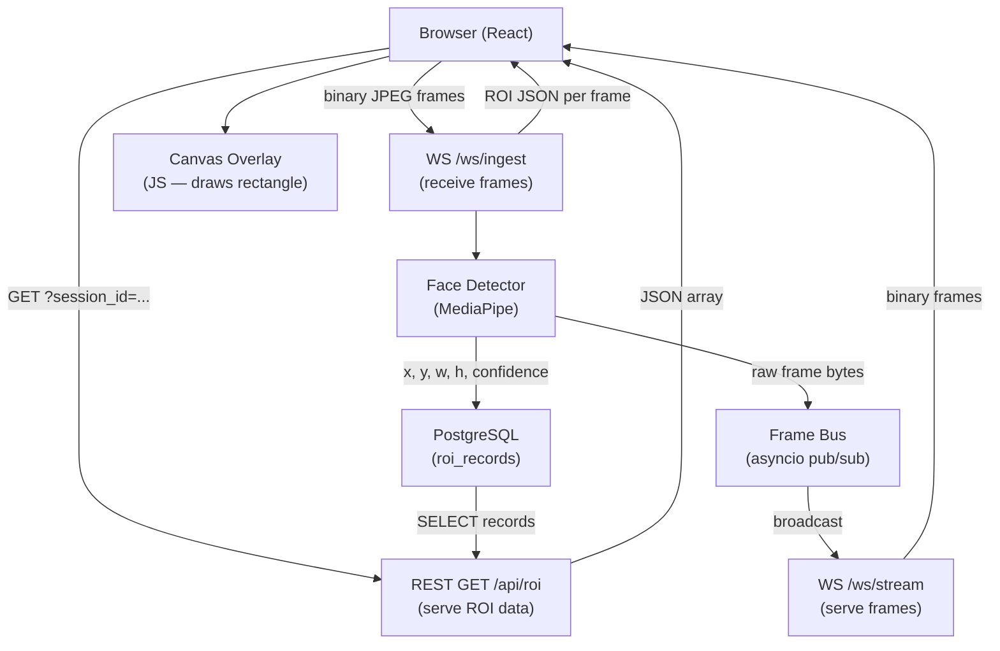

# Architecture

## Diagram

See [../diagrams/architecture.png](../diagrams/architecture.png).



## Components

### Browser / React Frontend

- Captures webcam frames using `getUserMedia` + an offscreen `<canvas>`.
- Sends each JPEG-encoded frame as a binary WebSocket message to `/ws/ingest`.
- Receives ROI JSON (`{"face_detected": true, "x": …, "y": …, "w": …, "h": …}`) on the
  same connection and stores the latest ROI in React state.
- Draws each received webcam frame on a visible `<canvas>` and overlays the rectangle
  using the Canvas 2D API — **no server-side drawing**.
- Optionally connects to `/ws/stream` as a second viewer (demo / external viewer path).
- Queries `/api/roi` to display historical ROI records for a session.

### WS /ws/ingest

FastAPI `WebSocket` endpoint. Per connection:

1. Generates a `session_id` (UUID).
2. Sends a handshake JSON: `{"type": "session", "session_id": "..."}`.
3. For each incoming binary message:
   - Validates frame size against `MAX_FRAME_BYTES`.
   - Offloads face detection to a thread-pool executor (CPU-bound).
   - Writes an `roi_records` row to PostgreSQL.
   - Publishes the raw frame to the `FrameBus`.
   - Replies with a ROI JSON message on the same WebSocket.
4. On disconnect: logs, unregisters from bus (if applicable).

### WS /ws/stream

FastAPI `WebSocket` endpoint for passive viewers.

- Subscribes to the `FrameBus` on connect.
- Continuously reads frames from its `asyncio.Queue` and forwards them as binary messages.
- Uses a bounded queue (maxsize=2) so slow clients drop frames rather than accumulate lag.
- Unsubscribes and closes on disconnect.

### REST GET /api/roi

Standard HTTP endpoint for querying persisted ROI data.

- Query parameters: `session_id` (required), `limit` (default 100), `offset` (default 0).
- Returns: `{"session_id": "...", "total": N, "records": [{…}, …]}`.

### Face Detector (MediaPipe)

`services/detector.py` — stateless, thread-safe service.

- Decodes raw JPEG bytes using `Pillow` (no `cv2`).
- Converts to an RGB NumPy array.
- Runs `mediapipe.solutions.face_detection.FaceDetection` (short-range model, single face).
- Converts relative bounding box to absolute pixel coordinates.
- Returns `DetectionResult(face_detected, x, y, w, h, confidence)` or a no-face result.

**Why not OpenCV-Python?** The assignment explicitly forbids it. Pillow handles JPEG
decode/encode; MediaPipe provides the detection model. Our application code has zero
`import cv2` statements.

### Frame Bus

`services/frame_bus.py` — in-process pub/sub for raw frames.

- Maintains a set of `asyncio.Queue` instances (one per `/ws/stream` subscriber).
- `publish(frame)` uses non-blocking `put_nowait`, dropping frames for slow subscribers
  instead of growing an unbounded buffer.
- Thread-safe for use from the thread-pool executor via `loop.call_soon_threadsafe`.

### PostgreSQL / roi_records

Single table storing every detection result per frame per session:

| Column | Type | Notes |
|--------|------|-------|
| `id` | BIGSERIAL PK | auto-increment |
| `session_id` | UUID FK → sessions | groups frames |
| `frame_index` | INTEGER | 0-based counter within session |
| `detected_at` | TIMESTAMPTZ | server UTC time |
| `face_detected` | BOOLEAN | false if no face found |
| `x` | INTEGER NULL | bounding box left edge (px) |
| `y` | INTEGER NULL | bounding box top edge (px) |
| `w` | INTEGER NULL | bounding box width (px) |
| `h` | INTEGER NULL | bounding box height (px) |
| `confidence` | FLOAT NULL | detector score 0-1 |

Index on `session_id` for efficient per-session queries.

## Docker Layout

```
docker-compose.yml
├── service: backend   (FastAPI, port 8000)
├── service: frontend  (nginx serving React build, port 3000)
└── service: db        (postgres:16-alpine, port 5432 internal only)
```

All services share a Docker network `megaai_net`. The frontend container proxies
`/ws/*` and `/api/*` requests to the backend via nginx, so the browser only needs
one origin (`localhost:3000`).

## Request / Data Flow (end-to-end)

```
[Browser]
  │  1. getUserMedia() → webcam stream
  │  2. canvas.toBlob(jpeg) every ~100 ms
  │  3. ws.send(blob)   ──────────────────▶  [/ws/ingest]
  │                                              │ validate size
  │                                              │ thread_pool: detect()
  │                                              │   Pillow.open(bytes)
  │                                              │   mediapipe.process(rgb_array)
  │                                              │   → DetectionResult
  │                                              │ await db.insert(roi_record)
  │                                              │ frame_bus.publish(raw_bytes)
  │  4. ws.onmessage(roi_json) ◀─────────────── │ ws.send_json(roi_msg)
  │  5. draw frame on canvas
  │  6. draw rectangle from roi_json
  │
  │  (separately, /ws/stream viewer)
  │  7. ws2.onmessage(binary) ◀────────────── [/ws/stream]
  │                                              │ queue.get()  ◀── frame_bus
  │
  │  (separately, history panel)
  │  8. fetch('/api/roi?session_id=…') ──────▶  [GET /api/roi]
  │  9. ◀──────────────── [{frame_index, x, y, w, h, …}, …]
```
