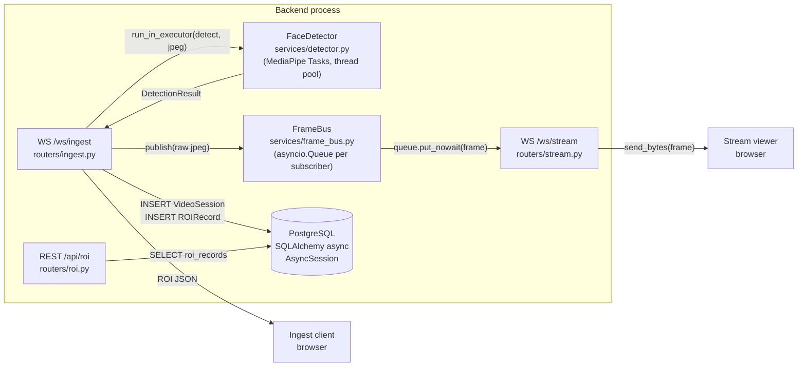
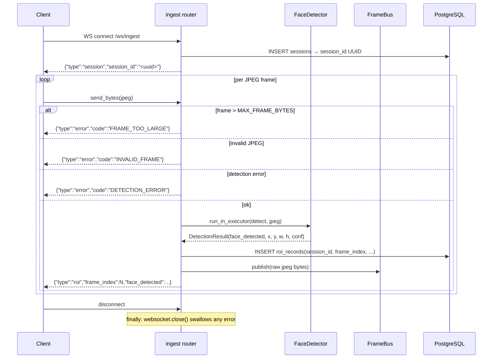
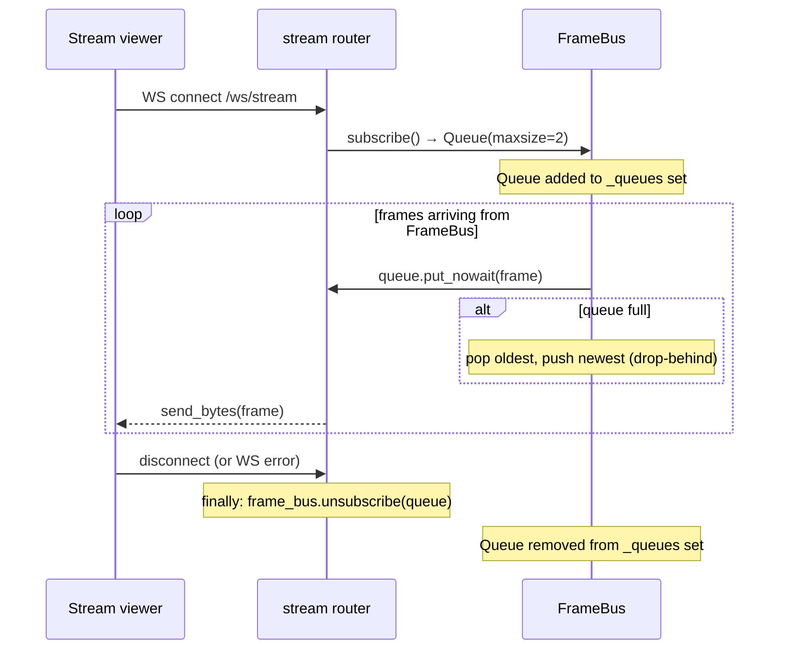
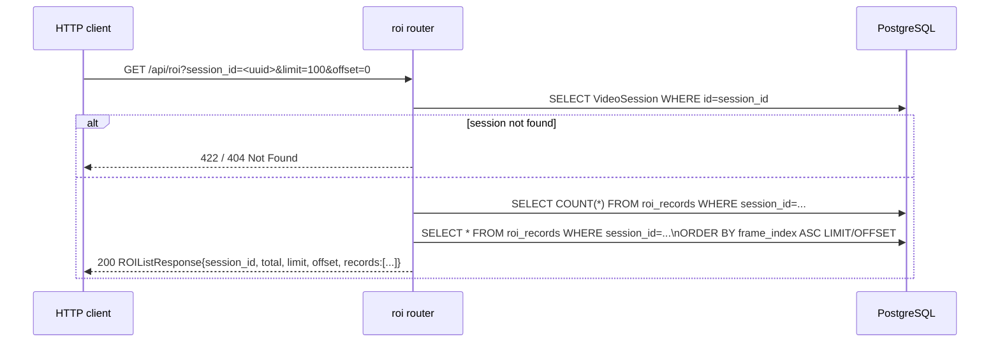

# Sprint 1 — Backend Core Architecture

**Sprint window:** Days 2–3 (May 5–6)  
**Status:** Implementation complete; integration test suite added in this sprint.

This document describes the internal architecture of the FastAPI backend introduced in
Sprint 1: the ingest pipeline, the passive stream path, and the REST query layer.
For higher-level context see [docs/ARCHITECTURE.md](../ARCHITECTURE.md).

---

## Component overview



### Layers at a glance

| Layer | File | Responsibility |
|-------|------|----------------|
| Entrypoint | `app/main.py` | FastAPI app, lifespan (detector + frame bus init), CORS |
| Ingest router | `app/routers/ingest.py` | Accept WS frames, offload detection, persist, fan-out |
| Stream router | `app/routers/stream.py` | Subscribe to bus, forward raw frames |
| ROI router | `app/routers/roi.py` | Paginated REST query of stored ROI records |
| Detector service | `app/services/detector.py` | Thread-safe MediaPipe Tasks FaceDetector wrapper |
| Frame bus | `app/services/frame_bus.py` | In-process pub/sub; bounded queue, drop-behind on full |
| DB models | `app/models/` | `VideoSession` (sessions table), `ROIRecord` (roi_records table) |
| Config | `app/config.py` | Pydantic-settings; reads `.env` |

---

## Sequence 1 — `/ws/ingest` lifecycle



**Implementation notes:**
- A new `VideoSession` is created per WS connection, not per frame. One session = one webcam session.
- Detection runs in `asyncio.get_running_loop().run_in_executor(None, ...)` to keep the event loop free.
- Each frame writes exactly one `ROIRecord` row regardless of whether a face was detected (`face_detected=False` rows preserve the frame index timeline).
- `frame_index` increments only after a successful detection round-trip; error frames do not advance the index.

---

## Sequence 2 — `/ws/stream` subscribe/drop/unsubscribe



**Drop-behind policy:** When the viewer is slow and its queue fills (maxsize=2), the FrameBus
pops the oldest frame and enqueues the latest. The viewer always sees the most recent frame when
it catches up — never stale data.

---

## Sequence 3 — `GET /api/roi` paginated query



**Validation chain:**
1. `session_id` is a required query param (UUID type); missing → `422 Unprocessable Entity`.
2. `limit` clamped `1–1000`; `offset` must be `≥ 0` (Pydantic `Query` validators).
3. Unknown session → `404 Not Found` with `{"detail":"Session not found"}`.

---

## Data flow — JPEG bytes to DB row

```
Browser canvas.toBlob("image/jpeg", 0.72)
  → ArrayBuffer  (≤ MAX_FRAME_BYTES = 1 MB)
  → WS binary frame
  → ingest handler receives `bytes`
  → Pillow.Image.open(io.BytesIO(bytes)).convert("RGB")
  → numpy.ascontiguousarray(arr, dtype=uint8)
  → mp_image.Image(ImageFormat.SRGB, arr)
  → FaceDetector.detect(mp_image) [thread pool]
  → DetectionResult(face_detected, x_px, y_px, w_px, h_px, confidence)
  → ROIRecord(session_id, frame_index, face_detected, x, y, w, h, confidence)
  → AsyncSession.commit()
```

The x/y/w/h coordinates are absolute pixel values relative to the JPEG frame dimensions
(not normalised). The frontend draws `ctx.strokeRect(x, y, w, h)` directly.

---

## Test coverage — Sprint 1

| Test file | What is tested |
|-----------|---------------|
| `tests/test_smoke.py` | `/openapi.json` and `/docs` return 200 |
| `tests/test_detector.py` | No-face white JPEG; invalid bytes → `ValueError` |
| `tests/test_frame_bus.py` | Single subscriber receives publish; two subscribers both receive |
| `tests/test_roi_api.py` | 404 unknown session; correct shape + pagination; offset beyond count; missing session_id → 422 |
| `tests/test_ws_ingest.py` | Handshake JSON; valid JPEG → ROI reply; oversized frame → error; invalid bytes → error; clean disconnect |
| `tests/test_ws_stream.py` | Stream client receives frame after ingest publishes one |

All tests use an **in-memory SQLite** database (via `aiosqlite`); no running Postgres required.
The real BlazeFace model file (`backend/models/blaze_face_short_range.tflite`) is used for
detector tests so that end-to-end JPEG → DetectionResult coverage is real, not mocked.

---

## Definition of Done — Sprint 1

- [x] `WS /ws/ingest` accepts binary frames and returns ROI JSON per frame
- [x] ROI records persisted to DB (one row per frame, face_detected nullable box)
- [x] `WS /ws/stream` subscribes to FrameBus and forwards raw JPEG frames
- [x] `GET /api/roi` returns paginated records, 404 for unknown session
- [x] Alembic migration `001` applies cleanly (`alembic upgrade head`)
- [x] `pytest -v` passes: smoke + detector + frame_bus + ROI API + WS integration
- [x] All tests run against in-memory SQLite; no external services required for `pytest`
- [x] Architecture + sequence diagrams documented in this file
