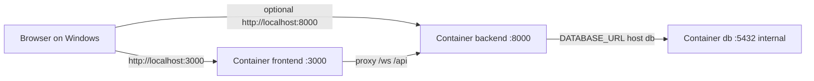

# Installing Docker on Windows and running this project

This guide is for developers who are **new to Docker** or **do not have Docker installed yet**. After installation, use [DOCKER.md](DOCKER.md) for everyday commands.

---

## What Docker is (simple explanation)

**Docker** packages your application and everything it needs (libraries, OS packages, database drivers) into **containers**: isolated, repeatable environments that run the same way on any machine.

For **this repository**, Docker Compose starts three containers:

| Container | What it runs |
|-------------|----------------|
| **Postgres** (`db`) | Database where face-detection results (ROI) are stored |
| **Backend** | Python + FastAPI (API, WebSockets, face detection) |
| **Frontend** | Built React app + nginx (serves the web UI and proxies API traffic) |

**Why we use it:** You avoid manually installing Python 3.11, MediaPipe system libraries, Node, and PostgreSQL on Windows. One command (`docker compose up --build`) builds and starts the full stack.

---

## How the three services connect

All three share a private Docker network called `megaai_net`. Inside that network, each service has a **name** that other services use as a hostname:

- The **backend** connects to the database at host **`db`**, port **5432** (not visible on your Windows host by default).
- The **browser** (on your PC) only talks to **ports published** on your machine: **8000** (API) and **3000** (frontend).



The **frontend** container runs **nginx**. It forwards requests starting with `/ws/` or `/api/` to the **backend** container. So you usually open only **http://localhost:3000** in the browser; nginx sends WebSocket and REST calls to the backend for you.

---

## Prerequisites

- **Windows 10** (64-bit, 21H2 or newer) or **Windows 11**
- **Hardware virtualization** enabled in BIOS/UEFI (often named Intel VT-x / AMD-V). Required for WSL2 and Docker.
- At least **4 GB RAM** free for Docker (8 GB system RAM recommended)
- Administrator rights for installing WSL2 and Docker Desktop

---

## Step 1 — Install WSL2 (Windows Subsystem for Linux)

Docker Desktop on Windows uses **WSL2** as the default engine. Install WSL if you do not have it:

1. Open **PowerShell** or **Command Prompt** **as Administrator**.
2. Run:

   ```powershell
   wsl --install
   ```

   This installs the default Linux distribution (often Ubuntu) and WSL2.

3. **Restart** your PC if prompted.
4. After reboot, a Linux distro may finish setup (create a UNIX username/password when asked).

5. Verify:

   ```powershell
   wsl --status
   ```

   You should see WSL2 mentioned.

**If `wsl --install` is not available:** Update Windows (Settings → Windows Update), then try again. Older instructions used manual steps; see [Microsoft WSL install docs](https://learn.microsoft.com/en-us/windows/wsl/install).

---

## Step 2 — Install Docker Desktop

1. Download **Docker Desktop for Windows** from the official site:  
   **https://www.docker.com/products/docker-desktop/**

2. Run the installer.
   - When asked, enable **Use WSL 2 instead of Hyper-V** (recommended).
   - Allow shortcuts and required Windows features if prompted.

3. **Restart** if the installer asks.

4. Start **Docker Desktop** from the Start menu. Wait until it says **Docker is running** (whale icon in the system tray).

5. Open **Settings** in Docker Desktop → **General** → ensure **Use the WSL 2 based engine** is checked.

---

## Step 3 — Verify Docker works

Open **PowerShell** (normal user is fine):

```powershell
docker --version
docker compose version
```

You should see version lines (e.g. `Docker version 24.x` and `Docker Compose version v2.x`).

Test pulling and running a tiny image:

```powershell
docker run --rm hello-world
```

If this prints a hello message from Docker, installation succeeded.

---

## Step 4 — Run this project

Work from the **repository root** (the folder that contains `docker-compose.yml`), **not** inside `backend/` alone.

### 4a — Environment file

Copy the example env file to `.env`:

**PowerShell:**

```powershell
cd C:\path\to\megaai
Copy-Item .env.example .env
```

The defaults in `.env.example` work with Compose. In `docker-compose.yml`, the **backend** service sets `DATABASE_URL` to use host **`db`** (the Postgres container). You normally **do not** need to edit `.env` for a first run.

### 4b — Start everything

```powershell
docker compose up --build
```

- First run **downloads** base images and **builds** the backend and frontend (several minutes).
- You will see logs from `db`, `backend`, and `frontend`.
- When the backend is ready, you should see Uvicorn listening on port **8000**.

Press **Ctrl+C** to stop (or use `docker compose up -d` to run in the background; then `docker compose down` to stop).

### 4c — Open the app

- **API interactive docs:** **http://localhost:8000/docs**
- **Full UI (nginx + React):** **http://localhost:3000**  
  Click **Start webcam** and allow the browser to use the camera.

If a port is already in use, see [Troubleshooting](#common-first-run-problems) below.

---

## How project services are defined (short)

| Compose service | Image / build | Published on your PC | Role |
|-----------------|----------------|----------------------|------|
| `db` | `postgres:16-alpine` | *(none by default)* | PostgreSQL; data in Docker volume `postgres_data` |
| `backend` | Built from `./backend` | **8000** | FastAPI: runs `alembic upgrade head` then Uvicorn |
| `frontend` | Built from `./frontend` | **3000** → container port 80 | nginx + static React; proxies `/ws/` and `/api/` to backend |

**Startup order:** The backend waits until Postgres is **healthy** (`pg_isready`), so the database is ready before migrations run.

---

## Configuration (`.env`) explained

| Variable | Typical value | Meaning |
|----------|---------------|---------|
| `POSTGRES_USER` / `POSTGRES_PASSWORD` / `POSTGRES_DB` | `megaai` | Postgres login and database name inside the `db` container |
| `DATABASE_URL` | `postgresql+asyncpg://megaai:megaai@db:5432/megaai` in `.env.example` | Used by the app; **`db`** is correct **inside** Compose. Compose may override this with the same values pointing at `db`. |
| `MAX_FRAME_BYTES` | `1048576` | Largest JPEG frame accepted over WebSocket (1 MB) |
| `DETECTION_CONFIDENCE` | `0.5` | MediaPipe face-detection threshold |
| `CORS_ORIGINS` | `http://localhost:3000` | Browser origins allowed to call the API |
| `VITE_WS_BASE` / `VITE_API_BASE` | `ws://localhost:3000` / `http://localhost:3000` | Used when **building** the frontend image so the browser uses the same host as the page |

Change passwords for anything exposed beyond localhost; never commit a real `.env` to git.

---

## How the frontend reaches the backend

1. You open **http://localhost:3000** (frontend container).
2. The browser loads the React app from nginx.
3. WebSocket URLs like `ws://localhost:3000/ws/ingest` hit nginx, which **proxies** to `http://backend:8000/ws/ingest` inside Docker.
4. REST calls to `http://localhost:3000/api/roi` are proxied similarly.

So you **do not** need CORS to allow `localhost:8000` for requests that go through port 3000; `CORS_ORIGINS` still matters for direct calls to **8000**.

---

## Common first-run problems

| Symptom | What to try |
|---------|-------------|
| “Hardware assisted virtualization is off” | Enable VT-x/AMD-V in BIOS; ensure Hyper-V / WSL features are on |
| `docker` command not found | Install Docker Desktop and **start** it; restart PowerShell |
| Port **8000** or **3000** in use | Stop other apps using those ports, or change the left side of `ports:` in `docker-compose.yml` |
| Docker Desktop stuck “Starting…” | Reboot; update Docker Desktop; check WSL: `wsl --update` |
| Backend exits during migrations | `docker compose logs backend` — often DB not reachable (wait for `db` healthy) |
| Out of disk space during build | Clean Docker: Docker Desktop → Troubleshoot → Clean / prune; free WSL2 disk |

---

## Next steps

- Daily commands: [DOCKER.md](DOCKER.md)
- Database details: [POSTGRESQL.md](POSTGRESQL.md)
- Checklist: [SPRINT_1_UP_AND_RUNNING.md](SPRINT_1_UP_AND_RUNNING.md)

---

## Official references

- [Docker Desktop for Windows](https://docs.docker.com/desktop/install/windows-install/)
- [WSL installation](https://learn.microsoft.com/en-us/windows/wsl/install)
