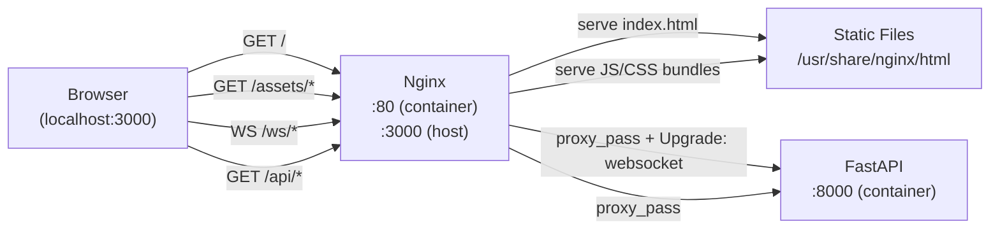

# Sprint 2 — Frontend Core Architecture

**Sprint window:** Day 4 (May 7)  
**Status:** Complete — React app implemented and component tests added.

---

## Component tree

```
App
├── <video ref={videoRef} style="display:none" />    ← hidden; feeds drawLoop
├── <canvas ref={capRef} style="display:none" />     ← capture canvas (toBlob → WS send)
└── <canvas ref={dispRef} style="display:block" />   ← display canvas (video + ROI rect)
```

`App` is a single component (no sub-components) that manages:
- Webcam `MediaStream` lifecycle
- WebSocket connection to `/ws/ingest`
- Canvas capture + JPEG encode loop (`setInterval`)
- Canvas display + ROI draw loop (`requestAnimationFrame`)
- Session and ROI state display

---

## Webcam capture data flow

```mermaid
sequenceDiagram
    participant U as User
    participant B as Browser API
    participant App as App.tsx
    participant WS as /ws/ingest

    U->>App: click "Start webcam"
    App->>B: navigator.mediaDevices.getUserMedia({video:true})
    B-->>App: MediaStream
    App->>App: video.srcObject = stream; video.play()
    App->>WS: new WebSocket(wsRoot() + "/ws/ingest")
    WS-->>App: onopen()
    App->>App: setRunning(true); start setInterval(120ms)

    loop every 120 ms
        App->>App: capRef.current.toBlob("image/jpeg", 0.72)
        App->>WS: ws.send(ArrayBuffer)
        WS-->>App: onmessage({type:"roi", ...})
        App->>App: setRoi(msg)
    end

    loop requestAnimationFrame
        App->>App: cctx.drawImage(video, 0,0,w,h)   [cap canvas]
        App->>App: dctx.drawImage(video, 0,0,w,h)   [disp canvas]
        alt roi.face_detected && coords not null
            App->>App: dctx.strokeRect(roi.x, roi.y, roi.w, roi.h)
        end
        App->>App: requestAnimationFrame(drawLoop)
    end
```

**Key design decisions:**

- **Two canvases**: `capRef` (hidden) is used only for `toBlob` JPEG encoding; `dispRef` (visible) draws the live frame + ROI overlay. This separation avoids flickering from canvas resizing during encode.
- **Capture rate 120 ms** (≈8 fps) — a pragmatic balance between responsiveness and frame size at `quality=0.72`.
- **Client-side ROI drawing** — the server returns `{x,y,w,h}` pixel coordinates; the browser calls `ctx.strokeRect` directly. No video compositing on the server.

---

## WebSocket message types

| Direction | `type` | Purpose |
|-----------|--------|---------|
| Server → Client | `"session"` | One-time; carries `session_id` UUID |
| Server → Client | `"roi"` | Per-frame; carries `face_detected`, `x`, `y`, `w`, `h`, `confidence` |
| Server → Client | `"error"` | Error; carries `code` and `detail` |

---

## nginx proxy map



**nginx.conf rules:**

| `location` | Proxy target | Notes |
|------------|-------------|-------|
| `/ws/` | `http://backend:8000` | `Upgrade: websocket`, `Connection: upgrade`, `proxy_read_timeout 86400s` |
| `/api/` | `http://backend:8000` | Standard HTTP proxy, `X-Forwarded-For` header |
| `/` | static files | `try_files $uri $uri/ /index.html` (SPA fallback) |

---

## Environment variables used by the frontend

| Variable | Default at runtime | Purpose |
|----------|--------------------|---------|
| `VITE_WS_BASE` | `${location.protocol}//${location.host}` | Override WS base URL (e.g. for dev without Vite proxy) |
| `VITE_API_BASE` | `${location.protocol}//${location.host}` | Override REST API base URL |

In **development** (`npm run dev`), Vite's dev server proxies `/ws` and `/api` to `http://127.0.0.1:8000`.  
In **production** (Docker), nginx handles the same proxying at runtime.

---

## Test coverage — Sprint 2

| Test file | What is tested |
|-----------|---------------|
| `src/__tests__/App.test.tsx` | Render: heading, Start button, canvas, disabled history btn, footer; WS messages: session_id set, history btn enabled, error displayed, malformed JSON ignored; Stop: button appears, `ws.close()` called |
| `src/__tests__/canvasOverlay.test.tsx` | Canvas present in DOM; ROI state set correctly (x,y,w,h,confidence) from `roi` message; confidence badge renders; frame_index increments; no confidence badge on face_detected=false |

---

## Definition of Done — Sprint 2

- [x] `<canvas>` captures webcam frames and encodes them as JPEG via `toBlob`
- [x] Frames sent to `/ws/ingest` at ~8 fps over WebSocket
- [x] ROI JSON received and stored in React state
- [x] `ctx.strokeRect(x, y, w, h)` draws bounding box when `face_detected=true`
- [x] Session ID and per-frame ROI info displayed in the UI
- [x] Frontend served by Nginx in Docker (`localhost:3000`)
- [x] `/ws/*` and `/api/*` proxied by nginx to backend
- [x] Vitest tests pass: `npm test` (16 tests, 2 files)
